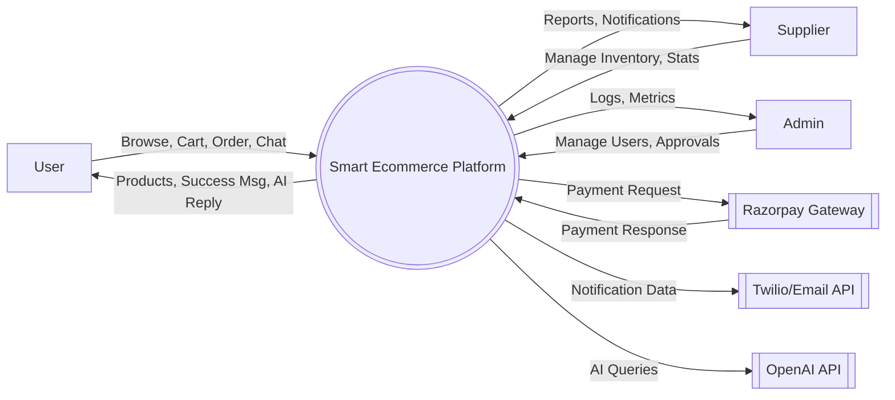
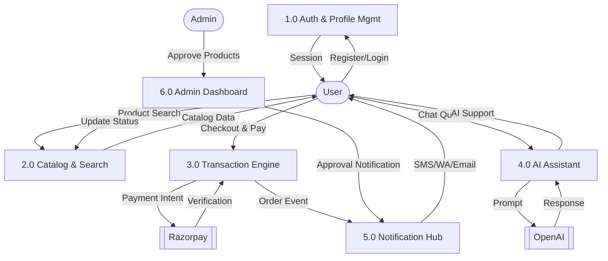
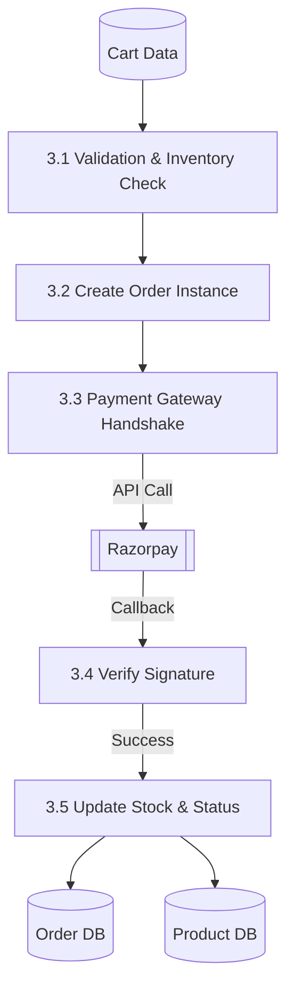
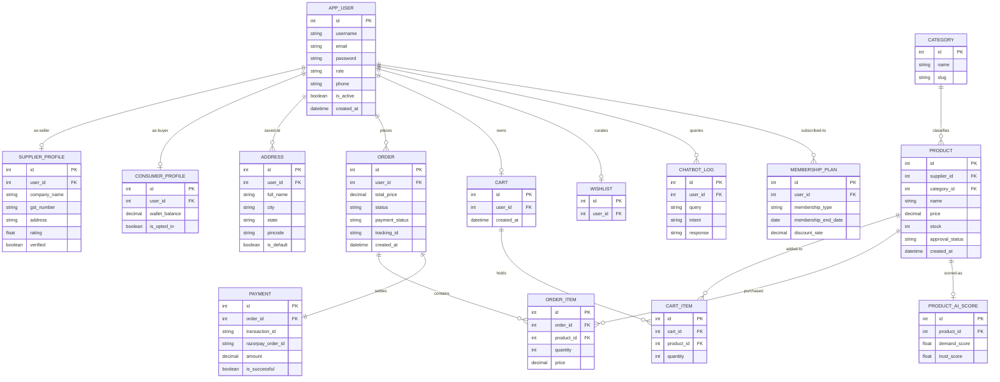

# Detailed Database Design & Data Flow Diagrams (DFD)

This document provides a highly detailed technical specification of the **Smart Ecommerce Platform (Bloom & Buy)** database architecture and logical data flow.

---

## 1. Data Flow Diagrams (DFD)

### DFD Level 0: Context Diagram
The Level 0 DFD defines the system boundary and external entities.

### DFD Level 1: Functional Breakdown
Breaking the system into core sub-processes.

### DFD Level 2: Order & Payment Processing
Refining the transaction process.

---

## 2. Comprehensive Data Dictionary

### 2.1 User & Identity Management
| Table Name | Field Name | Datatype | Constraints | Description |
| :--- | :--- | :--- | :--- | :--- |
| **auth_user** | `id` | INT | PK | Django's built-in user model. |
| | `username` | VARCHAR | Unique | Login handle. |
| | `email` | VARCHAR | Unique | Account identifier. |
| **AppUser** | `id` | INT | PK | Custom wrapper for user roles. |
| | `user_auth` | INT | FK (auth_user) | Link to Django Auth. |
| | `role` | ENUM | admin/supplier/consumer| Access control levels. |
| **SupplierProfile**| `user_id`| INT | FK (AppUser) | Seller specific details. |
| | `company_name`| VARCHAR | NOT NULL | Business name. |
| | `gst_number` | VARCHAR | Nullable | Tax registration. |
| **ConsumerProfile**| `user_id`| INT | FK (AppUser) | Buyer specific details. |
| | `wallet_balance`| DECIMAL | Default 0 | In-app credit for refunds. |
| **Address** | `user_id` | INT | FK (AppUser) | Delivery address repository. |

### 2.2 Store & Inventory
| Table Name | Field Name | Datatype | Constraints | Description |
| :--- | :--- | :--- | :--- | :--- |
| **Category** | `id` | INT | PK | Product grouping. |
| | `name` | VARCHAR | Unique | Category label. |
| **Product** | `id` | INT | PK | Main inventory item. |
| | `supplier_id`| INT | FK (auth_user) | Reference to seller. |
| | `category_id`| INT | FK (Category) | Product category link. |
| | `price` | DECIMAL | > 0 | Unit price. |
| | `stock` | INT | >= 0 | Quantity available. |
| | `approval_status`| ENUM | pending/approved/rejected | Admin moderation state. |
| **CartItem** | `cart_id` | INT | FK (Cart) | Items in user basket. |
| | `product_id` | INT | FK (Product) | Item reference. |
| | `quantity` | INT | > 0 | Count of items. |

### 2.3 Sales & Transactions
| Table Name | Field Name | Datatype | Constraints | Description |
| :--- | :--- | :--- | :--- | :--- |
| **Order** | `id` | INT | PK | Unique transaction ID. |
| | `user_id` | INT | FK (auth_user) | Buyer reference. |
| | `total_price`| DECIMAL | NOT NULL | Amount paid. |
| | `status` | ENUM | Pending...Delivered | Delivery progress. |
| **OrderItem** | `order_id` | INT | FK (Order) | Line items in order. |
| | `product_id` | INT | FK (Product) | Item purchased. |
| **Payment** | `id` | INT | PK | Financial audit log. |
| | `order_id` | INT | FK (Order) | Linked order. |
| | `transaction_id`| VARCHAR | Unique | Third-party TX ID. |

### 2.4 AI & Support
| Table Name | Field Name | Datatype | Constraints | Description |
| :--- | :--- | :--- | :--- | :--- |
| **ChatbotLog** | `user_id` | INT | FK (AppUser) | History of AI interactions. |
| | `query` | TEXT | | User's question. |
| | `response` | TEXT | | AI's generated answer. |
| **ProductAIScore**| `product_id`| INT | FK (Product) | Machine learning rating. |

---

## 3. Comprehensive Entity Relationship (ER) Diagram

This diagram represents the full schema with all significant fields (attributes) to show the "data" structure of each table.

---
*End of Technical Specification Version 2.2*
