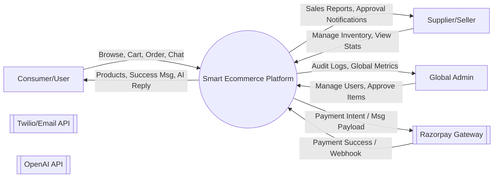
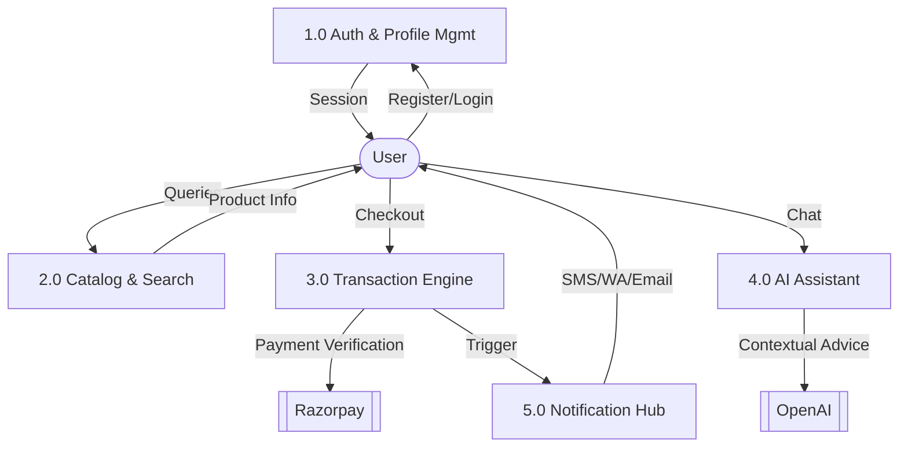
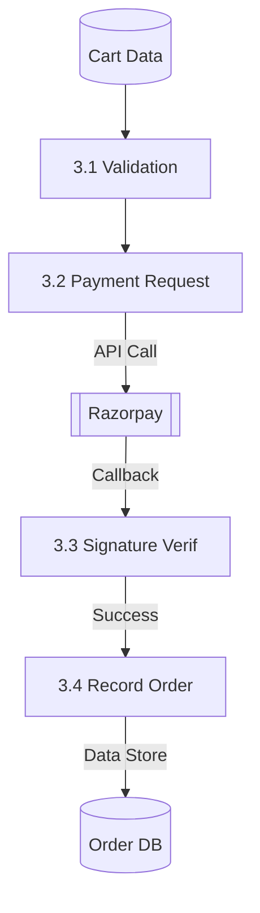
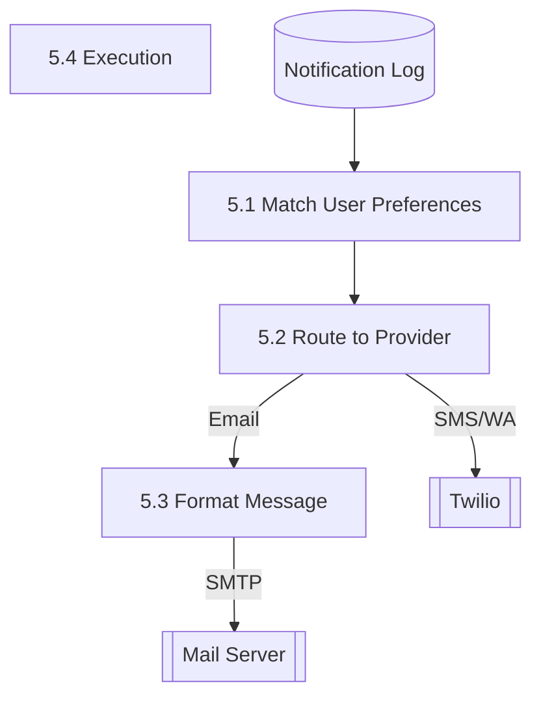
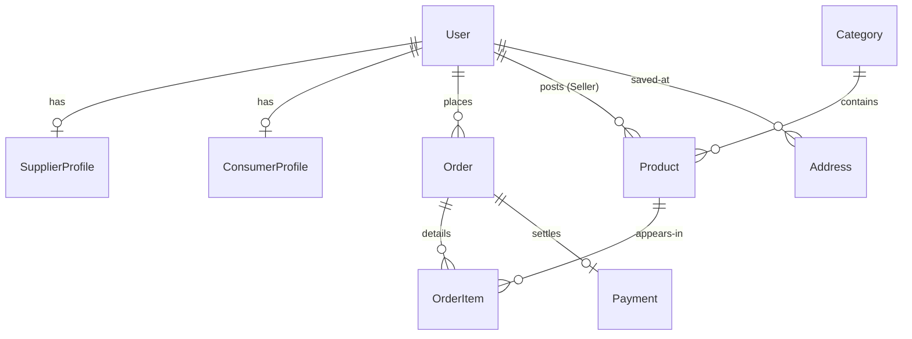
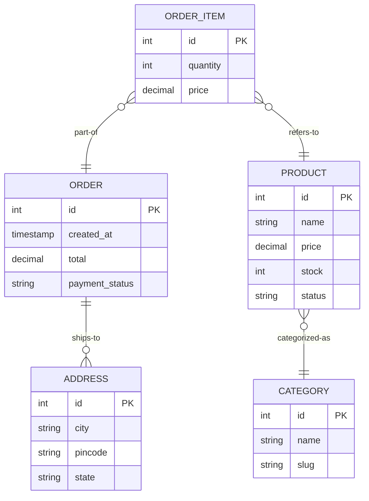

# Detailed Database Design & Data Flow Diagrams (DFD)

This document provides a highly detailed technical specification of the **Bloom & Buy** database architecture and logical data flow.

---

## 1. Data Flow Diagrams (DFD)

### DFD Level 0: Context Diagram
The Level 0 DFD defines the system boundary and external entities.

### DFD Level 1: Functional Breakdown
Breaking the system into core sub-processes.

### DFD Level 2: Order Processing Detail
Refining the transaction process (3.0 from Level 1).

### DFD Level 3: Logic flow for Notifications
Micro-level steps for the notification mesh.

---

## 2. Comprehensive Database Design (Data Dictionary)

### Table 1: `auth_user` (Django Default + Extension)
| Field Name | Datatype | Constraints | Description |
| :--- | :--- | :--- | :--- |
| `id` | INT | PK, Auto Inc | Primary ID of the user. |
| `username`| VARCHAR(150)| Unique | Unique login handle. |
| `email` | VARCHAR(255)| Unique | User email for Auth/Email. |
| `password`| VARCHAR(255)| Encrypted | Hashed user password. |

### Table 2: `store_product` (Inventory)
| Field Name | Datatype | Constraints | Description |
| :--- | :--- | :--- | :--- |
| `id` | INT | PK | Unique product identifier. |
| `name` | VARCHAR(200)| NOT NULL | Name of the product. |
| `price` | DECIMAL(10,2)| > 0 | Unit price. |
| `stock` | INT | NOT NULL | Available quantity. |
| `category_id`| INT | FK (store_category) | Link to category. |
| `supplier_id`| INT | FK (auth_user) | Link to seller user. |
| `approval` | VARCHAR(20) | Default 'pending' | Status: approved/rejected. |

### Table 3: `orders_order` (Transactions)
| Field Name | Datatype | Constraints | Description |
| :--- | :--- | :--- | :--- |
| `id` | INT | PK | Unique order ID. |
| `user_id` | INT | FK (auth_user) | Consumer who ordered. |
| `total_price`| DECIMAL(10,2)| NOT NULL | Final amount including tax. |
| `status` | VARCHAR(20) | Default 'Pending' | Pending, Shipped, Delivered. |
| `is_paid` | BOOLEAN | Default False | Payment status flag. |
| `tracking_id`| VARCHAR(100)| Nullable | Logistic tracking number. |

### Table 4: `orders_payment` (Finance)
| Field Name | Datatype | Constraints | Description |
| :--- | :--- | :--- | :--- |
| `id` | INT | PK | Payment record ID. |
| `order_id` | INT | FK, Unique (Order)| Link to specific order. |
| `rp_order_id`| VARCHAR(100)| Unique | Razorpay generated ID. |
| `signature` | VARCHAR(255)| NOT NULL | Razorpay verification sig. |
| `status` | VARCHAR(20) | NOT NULL | Success, Failed, Refunded. |

---

## 3. Database Relationship Diagram (DRD)

---

## 4. Entity Relationship (ER) Diagram
Detailed attributes and entity sets.

---
*End of Technical Specification.*
