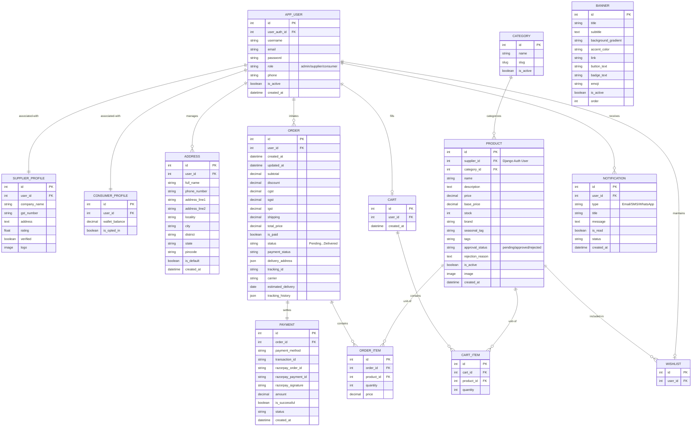

# Detailed Database Relationship Diagram (ERD)

This document provides a comprehensive technical mapping of the **Bloom & Buy** database schema, showing every table, field, data type, and relationship as implemented in the Django backend.

### Logical Annotations:
1.  **Identity Split:** The system uses a Django `User` model for authentication, linked to an `AppUser` for role-based logic, which further branches into `SupplierProfile` or `ConsumerProfile` for specific metadata.
2.  **Financial Integrity:** The `ORDER` table stores a calculated snapshot of taxes (CGST/SGST/IGST) and discounts at the time of purchase to ensure historical audit accuracy.
3.  **Logistics Tracking:** The `tracking_history` is stored as a JSON blob to allow flexible, timeline-based tracking updates without schema changes.
4.  **Moderation Workflow:** The `PRODUCT` table includes `approval_status` and `rejection_reason` to facilitate the Admin-to-Supplier communication loop.
