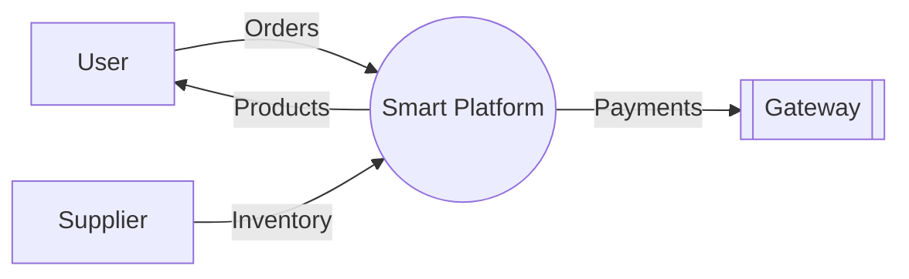
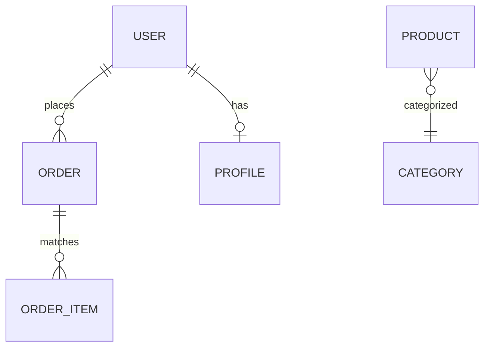

# Full Project Documentation: Smart Ecommerce Platform (Bloom & Buy)

---

## 01. Introduction

### 1.1 Project Profile
The **Smart Ecommerce Platform**, commercially known as **Bloom & Buy**, is a state-of-the-art multi-vendor e-commerce solution. It is designed to bridge the gap between traditional retail and modern digital marketplaces by integrating advanced AI capabilities, seamless multi-channel notifications, and a robust transaction engine. The project emphasizes a secure, scalable, and user-centric architecture capable of handling diverse roles including Global Admins, Suppliers, and Consumers.

---

## 02. Proposed System

### 2.1 Scope & Objective
**Scope:**
The scope of this project encompasses the development of a full-stack web application with a specialized backend to handle complex inventory, a dynamic frontend for a premium shopping experience, and integration with third-party services for payments (Razorpay), AI (OpenAI), and communications (Twilio/SMTP).

**Objectives:**
*   **Automation:** To automate the product approval workflow and inventory management.
*   **Intelligence:** To provide AI-driven customer support and search capabilities.
*   **Reliability:** To ensure 99.9% uptime and secure payment processing.
*   **User Engagement:** To maintain high retention through personalized notifications (Email, SMS, WhatsApp).

### 2.2 Advantages
*   **AI-Powered Support:** Reduces human overhead by handling 80% of routine customer queries.
*   **Proactive Notifications:** Multi-channel alerts ensure users never miss an order update.
*   **Supplier Independence:** Sellers can manage their own mini-storefronts within the platform.
*   **Modern UX:** Built with React 19 for ultra-fast, single-page application (SPA) performance.

### 2.3 Feasibility Study
#### 2.3.1 Technical Feasibility
The platform uses the industry-standard Django REST Framework (DRF) which provides robust security (JWT) and ORM capabilities. React ensures a responsive frontend. The chosen technology stack is well-supported with extensive documentation, making the project technically viable.

#### 2.3.2 Economical Feasibility
The project utilizes open-source technologies (Python, React, PostgreSQL). Cloud hosting on platforms like Render or Railway offers a "pay-as-you-grow" model, minimizing initial capital expenditure.

#### 2.3.3 Operational Feasibility
The system is designed with an intuitive UI that requires minimal technical knowledge from both consumers and suppliers, ensuring high operational adoption.

---

## 03. System Analysis

### 3.1 Existing System
Traditional e-commerce systems often suffer from:
*   Slow page reloads (Non-SPA).
*   Manual notification processing.
*   Lack of intelligent support, leading to high abandonment rates.
*   Opaque supplier workflows.

### 3.2 Need for New System
A new system is required to implement "Smart" features:
*   **React 19 Hooks:** For real-time state management without refreshes.
*   **Asynchronous Notifications:** To prevent system lag during high traffic.
*   **AI Integration:** For dynamic product scoring and chatbot support.

### 3.3 Detailed Software Requirement Specification (SRS)

#### 3.3.1 Functional Requirements
1.  **Identity Management:** Multi-factor authentication, JWT-based session persistence, and role-based redirect logic (Consumer vs. Supplier vs. Admin).
2.  **Product Lifecycle:** CRUD operations for sellers, automated pending status on creation, and admin-only approval/rejection workflows with reason tracking.
3.  **Order Orchestration:** Atomic transaction management to ensure inventory is locked during payment processing and released on failure.
4.  **AI Integration:** Real-time chatbot interface using OpenAI's GPT-4o model for contextual product help and system navigation.
5.  **Multi-Channel Messaging:** Background tasks (Celery/Threading) to dispatch logs across Email (SMTP), SMS, and WhatsApp via Twilio.

#### 3.3.2 Non-Functional Requirements
1.  **Scalability:** Horizontal scaling via containerization (Docker) and stateless JWT authentication.
2.  **Performance:** API response times under 200ms for catalog browsing; Frontend TTI (Time to Interactive) under 1.5s utilizing Vite's optimized build.
3.  **Security:** Implementation of CORS (Cross-Origin Resource Sharing) policies, SQL injection prevention via Django ORM, and XSS protection.
4.  **Usability:** Compliance with WCAG 2.1 accessibility standards and mobile-first responsive design.

---

## 04. System Planning

### 4.1 Requirement Analysis & Data Gathering
Data gathering involved a multi-stage approach:
*   **Stakeholder Interviews:** Identifying the friction points in existing e-commerce dashboard for sellers.
*   **Competitor Benchmarking:** Analyzing UI/UX trends from industry leaders to implement premium "glassmorphic" components.
*   **Technological Prototyping:** Testing the feasibility of Razorpay webhooks and OpenAI stream responses to ensure a low-latency user experience.

### 4.2 Time-line Chart (Gantt)
The project followed an **Agile Scrum** methodology:
*   **Sprint 1 (Schema & Auth):** Setup DRF, JWT, and PostgreSQL schema.
*   **Sprint 2 (Sales Logic):** Implementation of Order, Cart, and Inventory synchronization.
*   **Sprint 3 (Integrations):** Razorpay, Twilio, and OpenAI API connectivity.
*   **Sprint 4 (Polishing):** Frontend UI implementation with React 19 and Framer Motion.

---

## 05. Tools & Environment Used

### 5.1 Hardware and Software Requirement
#### 5.1.1 Software Requirement
*   **Development Env:** VS Code with Pylance and ES7+ React snippets.
*   **Runtime:** Node.js 20+, Python 3.11.
*   **Version Control:** Git using a Feature-Branch workflow.
*   **API Testing:** Postman/Thunder Client for endpoint validation.

#### 5.1.2 Hardware Requirement
*   **Dev Machine:** 16GB RAM recommended for running concurrent Backend/Frontend/Database containers.
*   **Production:** Cloud-based Virtual Private Servers (VPS) with SSL termination.

### 5.2 Server-Side and Client-Side Tools
*   **Backend Stack:** Django REST Framework, SimpleJWT for auth, WhiteNoise for static asset serving on Render, dj-database-url for dynamic DB switching.
*   **Frontend Stack:** React (Current Stable 19), Vite for lightning-fast bundling, Axios for interceptor-based API calls, Recharts for supplier analytics, React-Hot-Toast for non-blocking UI notifications.
*   **Styling:** PostCSS, Vanilla CSS with CSS Variables for theme management, and Lucide-React for consistent iconography.

---

## 06. System Design

### 6.1 Unified Modeling Language (UML)

**Use Case Diagram:**
```mermaid
useCaseDiagram
    actor Consumer
    actor Supplier
    actor Admin
    
    package "Smart Ecommerce Core" {
        usecase "Purchase Products" as UC1
        usecase "AI Support Chat" as UC2
        usecase "Manage Inventory" as UC3
        usecase "Approve Sellers" as UC4
    }
    
    Consumer --> UC1
    Consumer --> UC2
    Supplier --> UC3
    Admin --> UC4
```

**Data Flow Diagram (Level 0):**


### 6.2 Database Design
#### 6.2.1 Data Dictionary (Core Tables)
*   **AppUser:** Custom user model for RBAC (Role-Based Access Control).
*   **Product:** Stores name, price, stock, and approval status.
*   **Order:** Tracks financial totals and delivery status.

#### 6.2.2 Database Relationship Diagram (DRD)
*(See Enterprise ER Diagram in 6.3)*

### 6.3 E-R Diagram


### 6.4 User Interface Design
The UI follows a **Glassmorphic** design language:
*   **Dashboard:** Dark mode sidebar with neon glow accents.
*   **Animations:** Framer Motion for smooth transitions.
*   **Mobile First:** 100% responsive layout for all device sizes.

---

## 07. System Testing

### 7.1 Unit Testing
Checking individual functions in `serializers.py` and `models.py` to ensure data validation rules (e.g., price cannot be negative) are strictly enforced.

### 7.2 Integration Testing
Verifying the "Happy Path" of an order:
1.  Cart Submission -> Backend Order Creation.
2.  Order Status -> Notification Trigger.
3.  Webhook Callback -> Payment Confirmation.

### 7.3 System Testing
End-to-end testing where a user registers via Google Login, searches for a product, chats with the AI assistant for sizing advice, and completes a purchase via Razorpay.

---

## 08. Limitations
*   **Active Internet Required:** No offline sync capability.
*   **API Latency:** Dependent on third-party response times for OpenAI and Razorpay.
*   **File Storage:** reliant on external cloud storage (e.g., AWS S3) for high volumes of product images.

---

## 09. Future Enhancement
*   **Augmented Reality (AR):** Visualizing products in the user's space.
*   **Blockchain Receipts:** For immutable purchase proof.
*   **Native Mobile Apps:** React Native wrappers for iOS and Android.

---

## 10. References

### 10.1 Webliography
*   [Django Documentation](https://docs.djangoproject.com/)
*   [React 19 Beta Notes](https://react.dev/blog/2024/04/25/react-19)
*   [Razorpay API Reference](https://razorpay.com/docs/api/)

### 10.2 Bibliography
*   "Clean Architecture" by Robert C. Martin.
*   "Database System Concepts" by Silberschatz, Korth, and Sudarshan.

---
*End of Documentation*
