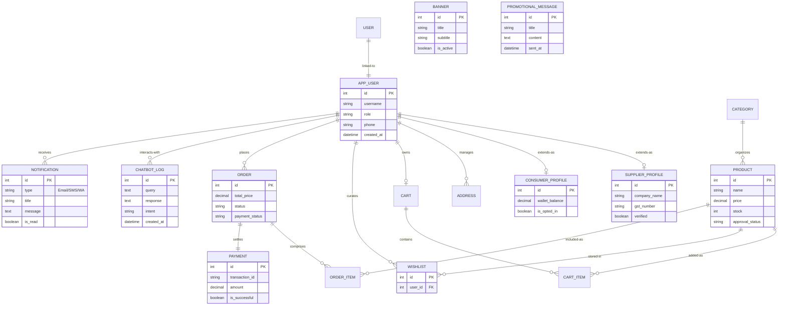

# Comprehensive Entity Relationship (ER) Diagram

This is the **ultimate technical master-map** of the database. It includes every functional table in the system, including AI Chatbot logs, Multi-channel Notifications, and Promotional Messaging.

## 1. The Global ER Master-Map

---

## 2. Exhaustive Data Catalog

### 2.1 Communication & AI (Deep Dive)
*   **CHATBOT_LOG:** Records every interaction with the OpenAI-powered assistant. Stores the `query` (user input), `response` (AI output), and the `intent` (classified by the NLP engine) for future training.
*   **NOTIFICATION:** The central ledger for the multi-channel alert system. Tracks the `type` (In-App, Email, SMS, WhatsApp) and the `is_read` status for consumer engagement.
*   **PROMOTIONAL_MESSAGE:** A standalone table managed by Admins to broadcast marketing content to specific roles (e.g., "All Consumers").

### 2.2 Product & Content Management
*   **PRODUCT:** Includes the `approval_status` field (Pending, Approved, Rejected) which is the core of the Admin moderation logic.
*   **BANNER:** Manages the dynamic hero section of the frontend, allowing admins to update marketing sliders without code changes.
*   **WISHLIST:** Maps the user's saved items. Unlike the Cart, this is for long-term "Save for Later" logic.

### 2.3 Order & Payment Integrity
*   **ORDER_ITEM:** Captures the `unit_price` at the moment of checkout. This is critical for financial auditing if the product price changes later.
*   **PAYMENT:** Stores the unique `transaction_id` from Razorpay, ensuring no duplicate payments are processed.

---

## 3. Relationship Integrity Rules

1.  **One-to-One Profile Logic:** Each `APP_USER` is strictly limited to one profile type based on their role, enforcing logical separation between the buyer and seller dashboards.
2.  **Cascading Deletes:** If an `APP_USER` is deleted, all related `NOTIFICATION` logs, `CHATBOT_LOG` records, and `ADDRESS` entries are purged to maintain data privacy.
3.  **Atomic Orders:** `ORDER_ITEM` records cannot exist without a parent `ORDER`, and `PAYMENT` must always link to a valid `ORDER`.

---
*Technical Specification: Smart Ecommerce Master Schema v3.0*
