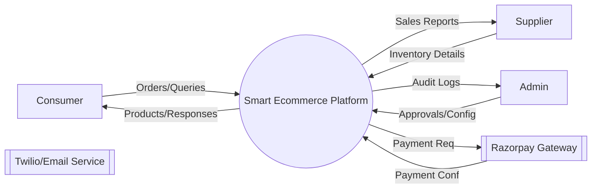
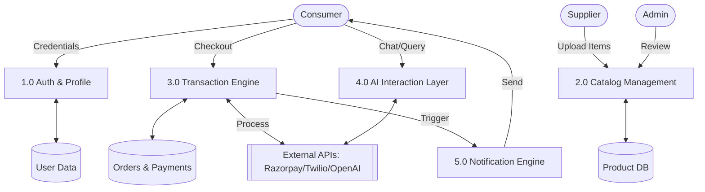
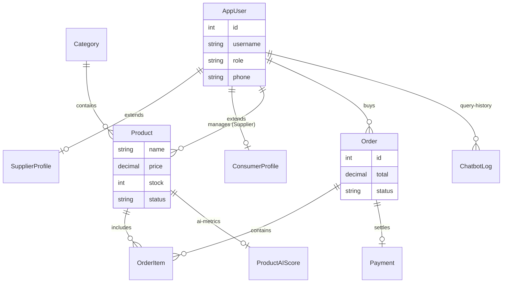
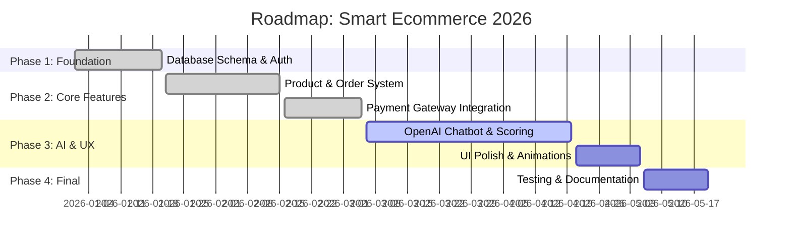

# Smart Ecommerce Project Documentation

This document provides a comprehensive architectural overview of the **Smart Ecommerce** platform. These diagrams are designed for project reports and technical documentation.

---

## 1. Use Case Diagram (Who can do what?)
This diagram shows the interactions between the different users (Actors) and the system's core features.

```mermaid
useCaseDiagram
    actor Consumer
    actor Supplier
    actor Admin
    
    package "Smart Ecommerce System" {
        usecase "Browse & Search Products" as UC1
        usecase "Add to Cart & Checkout" as UC2
        usecase "Chat with AI Assistant" as UC3
        usecase "Manage Product Catalog" as UC4
        usecase "View Sales Analytics" as UC5
        usecase "Approve/Reject Products" as UC6
        usecase "Manage Users" as UC7
        usecase "Process Payments (Razorpay)" as UC8
    }
    
    Consumer --> UC1
    Consumer --> UC2
    Consumer --> UC3
    
    Supplier --> UC4
    Supplier --> UC5
    
    Admin --> UC6
    Admin --> UC7
    
    UC2 ..> UC8 : <<includes>>
```

---

## 2. Data Flow Diagrams (DFD)

### DFD Level 0: Context Diagram
The Context Diagram defines the system boundary and its interactions with external entities.



### DFD Level 1: Functional Diagram
Level 1 breaks the system into its primary internal processes.



---

## 3. Entity Relationship (ER) Diagram
The ER diagram maps the database structure exactly as implemented in your Django backend.



---

## 4. Project Development Timeline
A roadmap showing the development history and upcoming phases.



---

## Final Checklist for Your Documentation
*   [x] **Diagram Consistency:** Actors (Consumer, Supplier, Admin) are consistent across all diagrams.
*   [x] **Technical Alignment:** ER Diagram matches the Django models in your `store` and `users` apps.
*   [x] **Integration Accuracy:** DFD reflects real integrations with Razorpay and OpenAI.
